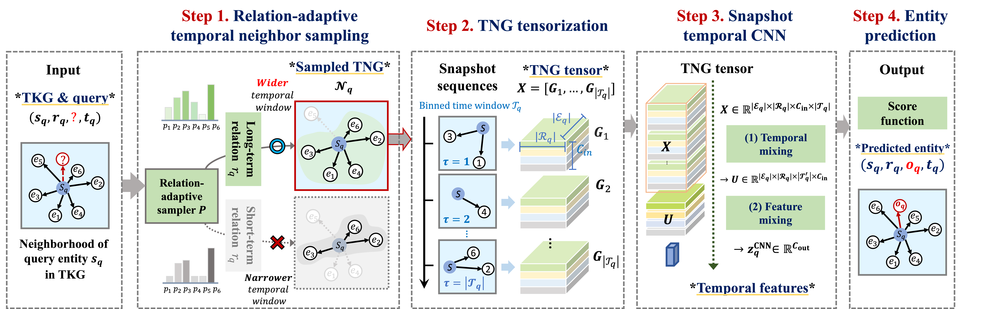

# TiRano

This repository is the official implementation of **"TiRano: Tensorized Relation-aware Temporal Reasoning for Accurate Knowledge Graph Completion"** (KDD 2026).

## Overeview of TiRano


---
This codebase supports **both**:
- **Interpolation** (bidirectional context around an observed timestamp), and
- **Extrapolation / forecasting** (strictly causal, past-only context).

## Requirements
We recommend using the following versions of packages:
- Python 3.8+
- PyTorch 2.x (recommended)
- NumPy, tqdm

Example install:
```bash
pip install numpy tqdm
# Install PyTorch from the official instructions for your CUDA/CPU environment.
```

---

## Repository entry points

- `preprocess.py`: preprocess raw splits into `processed/` artifacts (pickles + meta)
- `pretrain_kg.py`: (recommended) pretrain neighbor-aware KG embeddings for initialization
- `main.py`: train / resume / evaluate (test-only) Tirano

---
## Data Overview
We utilize widely used six datasets. To get started, download each dataset from the provided links.
|        **Dataset**        |                  **Link**                   |
|:-------------------------:|:-------------------------------------------:|
|       **ICEWS14**        |           `https://dataverse.harvard.edu/dataverse/icews`           |
|       **YAGO11K**        |           `https://github.com/soledad921/ATISE`           |
|       **ICEWS05-15**        |           `https://dataverse.harvard.edu/dataverse/icews`           |
|       **GDELT**        |           `https://github.com/nk-ruiying/TCompoundE`           |
|       **ICEWS14STAR**        |           `https://dataverse.harvard.edu/dataverse/icews`           |
|       **ICEWS18**        |           `https://dataverse.harvard.edu/dataverse/icews`           |

## Dataset format

### Directory layout

```text
dataset/<dataset_lower>/
  train.txt
  valid.txt   (optional)
  test.txt
  stat.txt    (optional but recommended)
```

Also supported: `<dataset_lower>_train.txt`, `<dataset_lower>_valid.txt`, `<dataset_lower>_test.txt`, `<dataset_lower>_stat.txt` (auto-detected).

### Supported line formats (raw splits)

Each line must be one of:

- `s r o t`
- `s r o t event_idx`  (e.g., event-indexed datasets)
- `s r o t_start t_end`  (interval datasets; time tokens may be strings like `1926-##-##` or `####-##-##`)

Notes:
- `s`, `r`, `o` are **integer IDs**.
- Time tokens `t` / `t_start` / `t_end` are converted into **integer timestamps** by `preprocess.py` (configurable via `--time_mode`).

### Interval datasets 

For interval-style datasets (e.g., YAGO11k), use `--file_format interval`.

```bash
# Default: use year granularity, convert interval -> a single timestamp (start)
python preprocess.py --dataset YAGO --data_dir dataset \
  --time_mode year --file_format interval --interval_mode start

# Optional: expand each interval into all integer timestamps in [start, end]
python preprocess.py --dataset YAGO --data_dir dataset \
  --time_mode year --file_format interval --interval_mode expand
```

---

## 1) Preprocess

Creates inverse-relation augmentation, filter dicts, adjacency for neighbor sampling, and `relation2alpha` (RTNS priors).

```bash
python preprocess.py --dataset ICEWS14 --data_dir dataset
```

Outputs:
```text
dataset/icews14/processed/
  train_data.pkl
  valid_data.pkl
  test_data.pkl
  sr2o.pkl
  srt2o.pkl
  o2srt_train.pkl
  o2srt_train_val.pkl
  relation2alpha.pkl
  meta.json
```

Tip: `stat.txt` is **recommended** when available, to ensure correct (upper-bound) entity/relation counts even if some IDs appear only in valid/test.

---

## 2) (Recommended) Pretrain embeddings

Pretrains neighbor-aware KG embeddings (static pretraining) and exports initialization tensors.

```bash
python pretrain_kg.py --dataset ICEWS14 --data_dir dataset --embed_dim 200
```

Output example:
```text
dataset/icews14/processed/pretrained_init_dim200.pt
```
---

## 3) Train Tirano

### Interpolation setting (bidirectional context)

Interpolation evaluates queries at observed timestamps and allows using events both before and after the query time.

```bash
python main.py --dataset ICEWS14 --data_dir dataset \
  --pretrained_ckpt dataset/icews14/processed/pretrained_init_dim200.pt \
  --context_mode all \
  --window_size 25 --window_future 25 \
  --device cuda --use_amp
```

### Extrapolation / forecasting setting

Extrapolation evaluates future timestamps unseen in training and must not use future events.

```bash
python main.py --dataset ICEWS14STAR --data_dir dataset \
  --pretrained_ckpt dataset/icews14star/processed/pretrained_init_dim200.pt \
  --context_mode past \
  --window_size 50 --window_future 0 \
  --device cuda --use_amp
```


## 4) Evaluation

### Test-only (evaluate a checkpoint)

```bash
python main.py --dataset ICEWS14 --data_dir dataset \
  --test_only --ckpt checkpoints/tirano_icews14_best.pt \
  --device cuda
```

---

## Resume training

`--epochs` is the **total** target epoch count (not “additional epochs”).

### (A) Resume from last checkpoint (recommended)
```bash
python main.py --dataset ICEWS14 --data_dir dataset \
  --pretrained_ckpt dataset/icews14/processed/pretrained_init_dim200.pt \
  --epochs 5 --resume_from last \
  --run_name tirano --save_dir checkpoints \
  --device cuda
```

### (B) Resume from best checkpoint
```bash
python main.py --dataset ICEWS14 --data_dir dataset \
  --epochs 5 --resume_from best \
  --run_name tirano --save_dir checkpoints \
  --device cuda
```
---

## Reference

If you use this code, please cite the following paper.
```bibtex
@inproceedings{lee2026tirano,
  title={TiRano: Tensorized Relation-aware Temporal Reasoning for Accurate Knowledge Graph Completion},
  author={Lee, SeungJoo, Park, Yong-chan and Kang, U},
  booktitle={Proceedings of the 32nd ACM SIGKDD Conference on Knowledge Discovery and Data Mining V. 2},
  year={2026}
}
